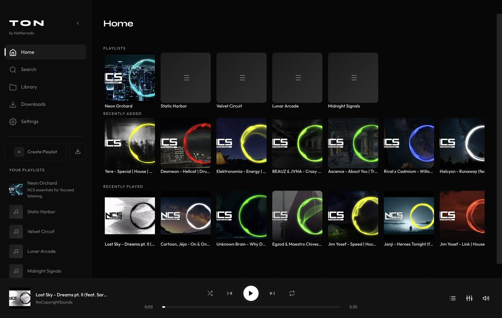
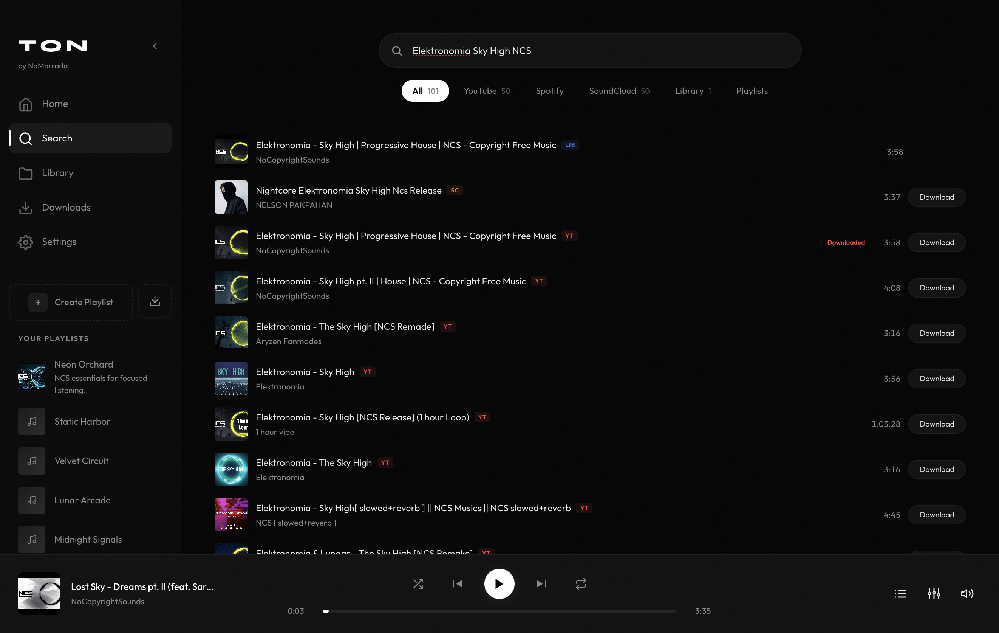
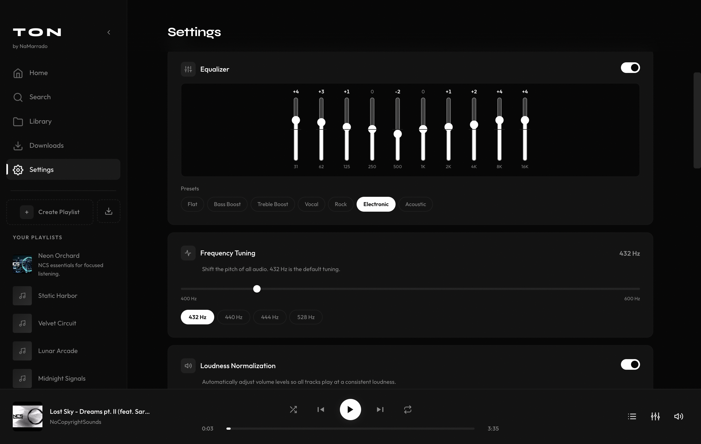
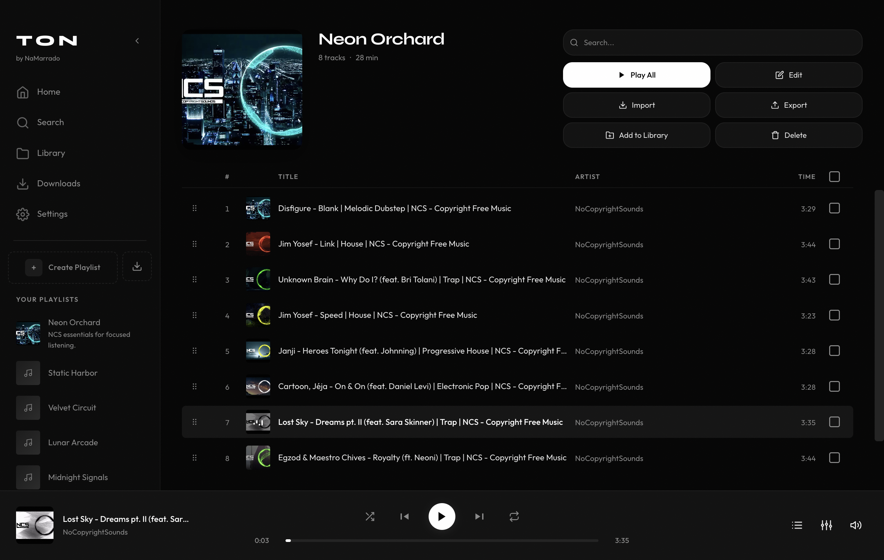
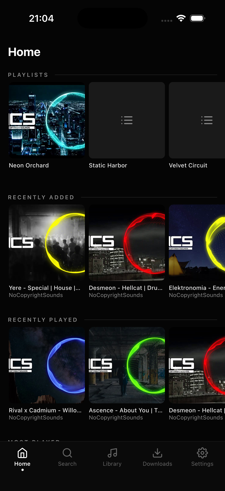
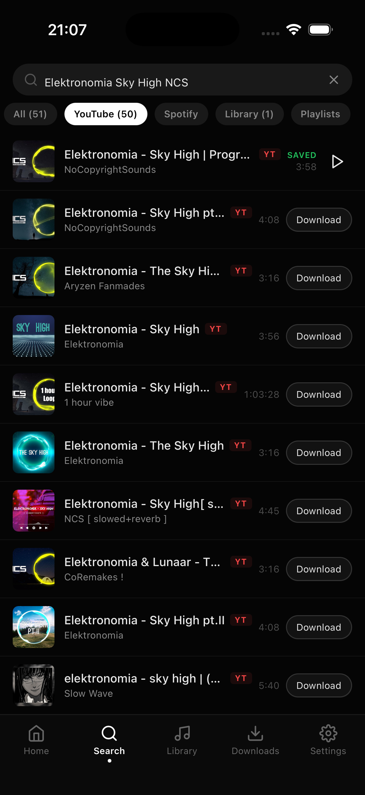
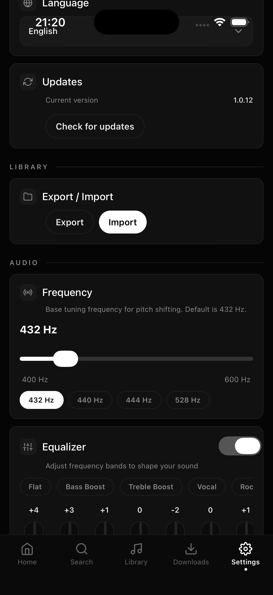
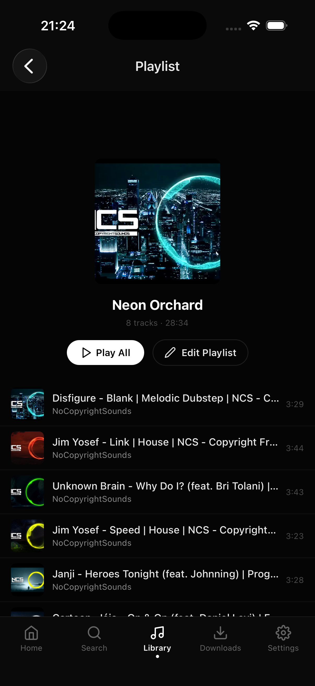

<div align="center">
  
  <h1>TON</h1>
  <p>
    A local-first music player with built-in search, downloads, playlists,
    audio tools, and optional Cloudflare R2 sync.
  </p>
</div>

## 📥 Download

<div align="center">
  <a href="https://github.com/NaMarrado/TON-Music-Player/releases/latest/download/TON-windows.exe"></a>
  <a href="https://github.com/NaMarrado/TON-Music-Player/releases/latest/download/TON-macos.dmg"></a>
  <a href="https://github.com/NaMarrado/TON-Music-Player/releases/latest/download/TON-linux.AppImage"></a>
  <a href="https://github.com/NaMarrado/TON-Music-Player/releases/latest/download/TON-android.apk"></a>
</div>

<br>

Production builds are published on the [GitHub Releases](https://github.com/NaMarrado/TON-Music-Player/releases/latest) page:

- **Windows:** NSIS installer (`.exe`)
- **macOS:** disk image (`.dmg`)
- **Linux:** AppImage
- **Android:** installable APK
- **iOS:** build and sign the app from source with your own Apple account

> Windows and macOS builds are not code-signed, so the operating system may show a security warning on first launch. Android v1.0.15 and newer use one permanent project signing key. Upgrading from v1.0.14 or older requires uninstalling TON once because those builds used temporary keys.

## 🤍 Support TON

If TON is useful to you, the easiest way to support the project is to star the repository, share it, or report anything that can be improved.

<div align="center">
  <a href="https://github.com/NaMarrado/TON-Music-Player"></a>
  <a href="https://discord.gg/4PHWaYXeT4"></a>
  <a href="https://github.com/NaMarrado/TON-Music-Player/issues/new"></a>
  <a href="https://github.com/NaMarrado"></a>
</div>

## ✨ Features

- 🔒 **Fully Local, No Account Required:** TON works without registration, sign-in, or a mandatory online service. Your music, playlists, settings, and playback data stay on your device; cloud sync is entirely optional.
- 🔊 **Tired of jumping from too quiet to too loud?** Phone volume controls often move in steps that are simply too large. TON adds its own independent volume layer without changing the device volume, letting you fine-tune playback between those system steps.
- 📥 **Download Entire Playlists:** Paste a Spotify or YouTube playlist and TON creates it locally, downloads the tracks, and adds each song in the original order as soon as it is ready. Playlists with more than 1,000 songs are supported; downloads take longer because TON respects YouTube rate limits.
- 🔀 **Actual Shuffle:** TON shuffles your entire queue and plays through every song instead of repeatedly picking from the same small group.
- ⚡ **Lightweight by Design:** A fast, focused player without ads, bloated dashboards, or unnecessary background services.
- 🧼 **Simple, Intentional UI:** A clean interface that stays out of the way. Every screen and control exists for a reason instead of filling the app with visual clutter.
- 🔎 **Unified Music Search:** Find music from YouTube, Spotify, and SoundCloud without switching apps.
- 🎮 **Discord Rich Presence on Desktop:** Share the current track, artist, artwork, and live playback progress on your Discord profile, with pause and resume reflected automatically.
- ⬇️ **Local Downloads:** Save playable audio directly to your device and listen offline.
- 🎵 **Library and Playlists:** Keep a separate main library, create playlists, reorder tracks, and preserve playlist order.
- ☁️ **Cloud Library:** Connect your own Cloudflare R2 bucket and move your library and playlists between devices.
- 🗂️ **Structured Cloud Storage:** Keep the main library and each playlist in clearly named folders with track order, metadata, and playlist covers preserved.
- 🎚️ **Advanced Audio Tools:** Loudness normalization, equalizer support, frequency tuning, repeat, and shuffle.
- 📱 **Native Mobile Playback:** Background audio, lock-screen controls, media notifications, and download progress on supported devices.
- 🖥️ **Cross-Platform:** One shared library experience across Windows, macOS, Linux, Android, and iOS.
- 🌍 **13 Languages:** Arabic, Chinese, Czech, English, French, German, Hebrew, Italian, Japanese, Polish, Portuguese, Russian, and Spanish.

## 🖥️ Platform Support

| Platform | Distribution | Status |
| --- | --- | --- |
| Windows | GitHub Release installer | Supported |
| macOS | GitHub Release DMG | Supported, unsigned |
| Linux | GitHub Release AppImage | Supported |
| Android | GitHub Release APK | Supported |
| iOS | Self-signed source build | Supported |

## 🚀 Quick Start

### Requirements

- [Node.js](https://nodejs.org/) 20 or newer
- [pnpm](https://pnpm.io/) 9 or newer through Corepack
- Platform tooling for mobile builds: Android Studio or Xcode

### Desktop Development

```bash
git clone https://github.com/NaMarrado/TON-Music-Player.git
cd TON-Music-Player
corepack pnpm install
corepack pnpm dev
```

### Mobile Development

```bash
# Android
corepack pnpm --filter @ton/mobile android

# iOS
corepack pnpm --filter @ton/mobile ios
```

## 📦 Production Builds

```bash
# Desktop package for the current operating system
corepack pnpm dist:desktop

# Signed Android release APK using a locally generated project key
corepack pnpm build:android:release
```

The first local Android release build creates a personal signing key in `.signing/android/`. Back up both files in that directory: losing the key prevents future APKs from updating builds signed with it. Official GitHub Release APKs use the maintainer's separate permanent key stored in GitHub Actions secrets.

For iOS, install the CocoaPods dependencies, open `packages/mobile/ios/TON.xcworkspace` in Xcode, select your Apple Development team, and build for your device. TON does not publish a pre-signed iOS binary.

## 🧱 Project Structure

```text
packages/
  core/      Shared types, scheduling, cloud sync, and utilities
  desktop/   Electron and React application
  mobile/    React Native and Expo application for Android and iOS
```

## 🛠️ Built With

- Electron, React, React Native, Expo, and TypeScript
- SQLite and Zustand
- FFmpeg, yt-dlp, YouTube.js, and native media playback
- Cloudflare R2 through the S3-compatible API
- pnpm workspaces

> Only download or sync media that you are permitted to use. TON does not provide or host music.

## 📄 License

TON is available under the [MIT License](LICENSE). You can use, modify, and distribute it freely. If TON helps your project, a mention or link back to [NaMarrado](https://github.com/NaMarrado) would be appreciated, but is not required.

## 🖼️ Gallery










