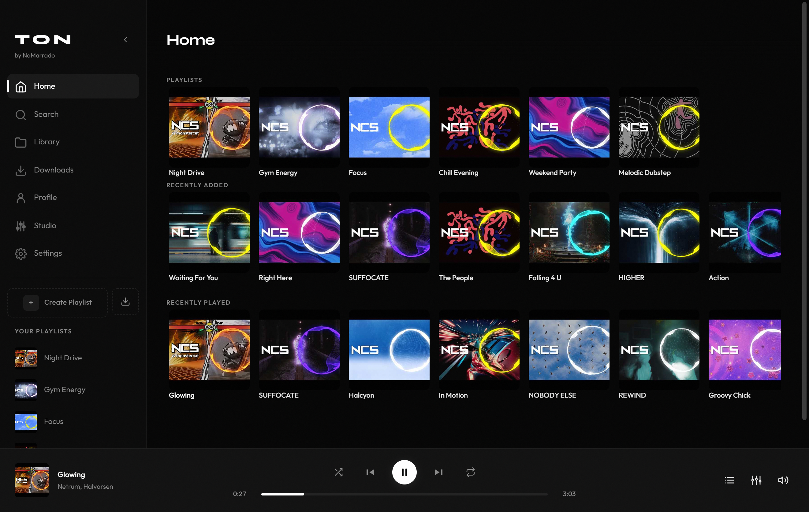
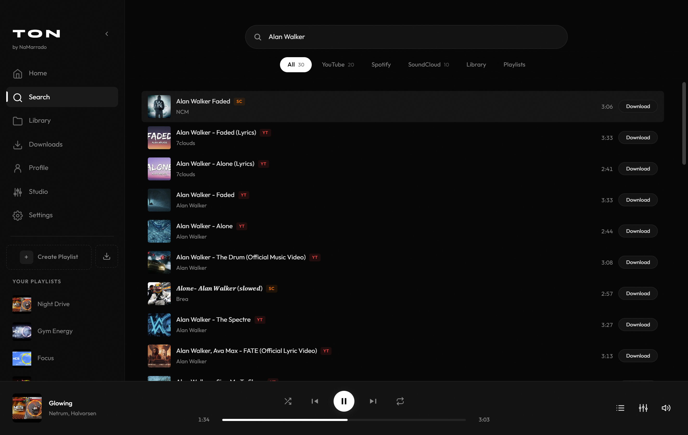
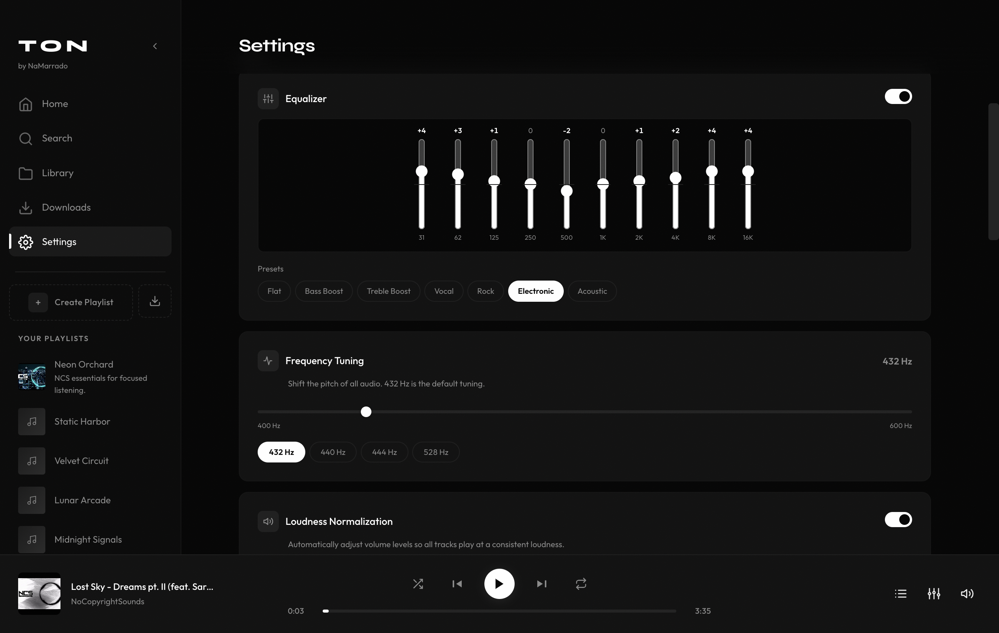
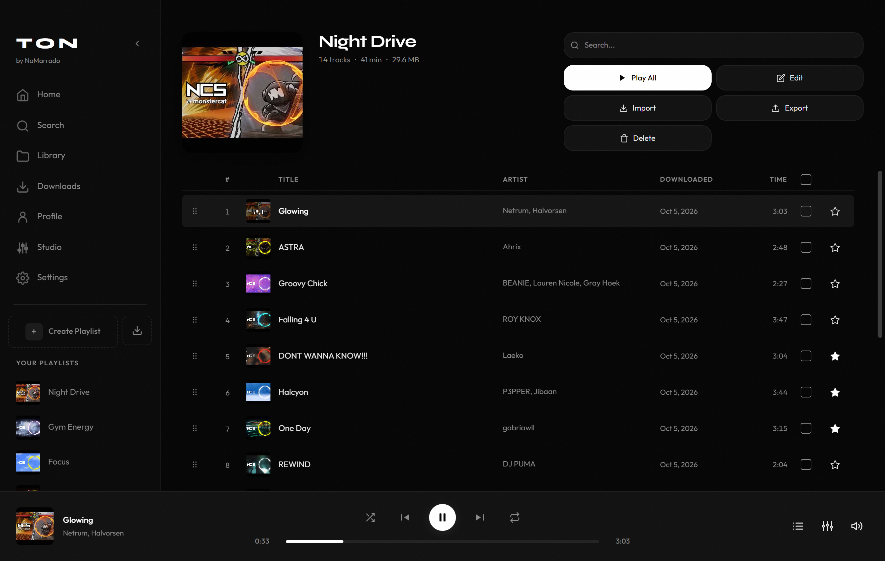
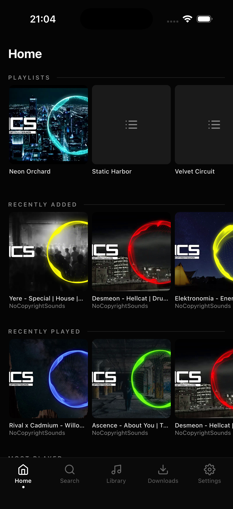
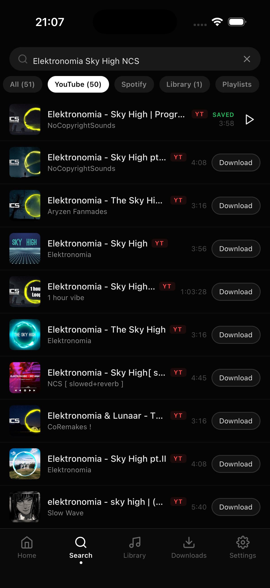
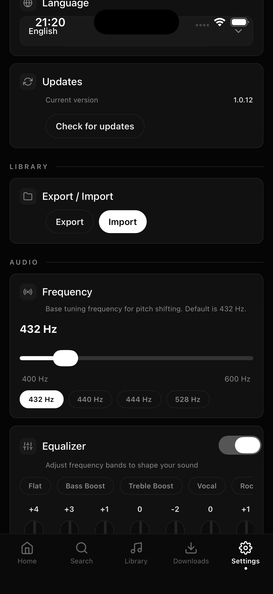
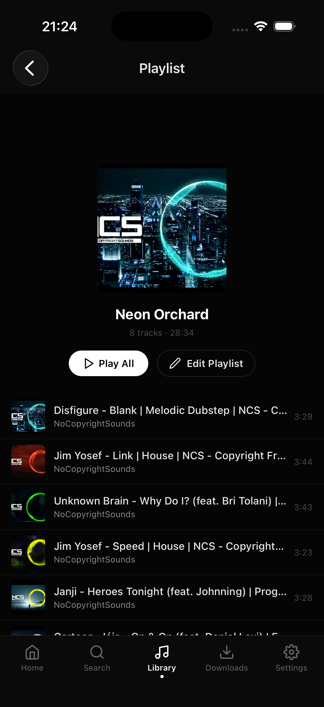

<div align="center">
  
  <h1>TON</h1>
  <p>
    A local-first music player with built-in search, downloads, playlists,
    audio tools, and optional Cloudflare R2 sync.
  </p>
</div>

## 📥 Download

<div align="center">
  <a href="https://github.com/NaMarrado/TON-Music-Player/releases/latest/download/TON-windows.exe"></a>
  <a href="https://github.com/NaMarrado/TON-Music-Player/releases/latest/download/TON-macos.dmg"></a>
  <a href="https://github.com/NaMarrado/TON-Music-Player/releases/latest/download/TON-linux.AppImage"></a>
  <a href="https://github.com/NaMarrado/TON-Music-Player/releases/latest/download/TON-android.apk"></a>
</div>

<br>

Production builds are published on the [GitHub Releases](https://github.com/NaMarrado/TON-Music-Player/releases/latest) page:

- **Windows:** NSIS installer (`.exe`)
- **macOS:** disk image (`.dmg`)
- **Linux:** AppImage
- **Android:** installable APK
- **iOS:** build and sign the app from source with your own Apple account

> Windows and macOS builds are not code-signed, so the operating system may show a security warning on first launch.

## 🤍 Support TON

If TON is useful to you, the easiest way to support the project is to star the repository, share it, or report anything that can be improved.

<div align="center">
  <a href="https://github.com/NaMarrado/TON-Music-Player"></a>
  <a href="https://discord.gg/4PHWaYXeT4"></a>
  <a href="https://github.com/NaMarrado/TON-Music-Player/issues/new"></a>
  <a href="https://github.com/NaMarrado"></a>
</div>

## ✨ Features

- 🔒 **Fully Local, No Account Required:** TON works without registration, sign-in, or a mandatory online service. Your music, playlists, settings, and playback data stay on your device; cloud sync is entirely optional.
- 🔊 **Tired of jumping from too quiet to too loud?** Phone volume controls often move in steps that are simply too large. TON adds its own independent volume layer without changing the device volume, letting you fine-tune playback between those system steps.
- 📥 **Playlist Import & Downloads:** Paste a supported playlist to recreate it locally while preserving the original track order. Only download tracks that you own or are authorized to use. Availability and permitted use depend on the source platform and the relevant rights holders.

  > **Copyright notice:** TON does not host, sell, or license music and is not affiliated with or endorsed by Spotify, YouTube, or SoundCloud. You are responsible for ensuring that every download complies with applicable law, the rights holder’s permission, and the source platform’s terms.

- 🔀 **Actual Shuffle:** TON shuffles your entire queue and plays through every song instead of repeatedly picking from the same small group.
- ⚡ **Lightweight by Design:** A fast, focused player without ads, bloated dashboards, or unnecessary background services.
- 🧼 **Simple, Intentional UI:** A clean interface that stays out of the way. Every screen and control exists for a reason instead of filling the app with visual clutter.
- 🔎 **Unified Music Search:** Find music from YouTube, Spotify, and SoundCloud without switching apps. Pasted YouTube song links recover available duration from exact-song metadata; live or unavailable durations remain unknown.
- 🎮 **Discord Rich Presence on Desktop:** Share the current track, artist, artwork, and live playback progress on your Discord profile, with pause and resume reflected automatically.
- ⬇️ **Local Downloads:** Save playable audio directly to your device and listen offline.
- 🎵 **Library and Playlists:** Keep a separate main library, create playlists, reorder tracks, and preserve playlist order. Desktop tables hide less-important columns as available space shrinks, while retaining song titles, selection, and favorites.
- **Starred Favorites:** Mark songs with the star beside their selection control and use Library’s **Starred** filter to play only favorites. Stars are stored in the shared R2 manifest. Text search only filters displayed rows; it does not narrow the Library or playlist playback source.
- 📊 **Profile Statistics (Desktop):** See your listening in numbers: time listened, plays, favorite songs and artists, with charts over time and a detail page for every song. Filter by period or device; stats sync through your own R2 when cloud sync is on.
- 💾 **Profile Export:** Save your whole profile, including settings, starred songs, playlists and listening history, to one file and restore it on another device. Passwords and keys are never included.
- 🎛️ **Studio:** A simple multi-track editor for making your own versions of songs. Layer songs from your Library, playlists or Search, slow them down, add reverb or bass boost, cut and crossfade them, then export the result to your Library.
- ☁️ **Cloud Library:** Connect your own Cloudflare R2 bucket and move your library and playlists between devices. Auto Sync publishes local changes as well as receiving remote changes. After initial identity reconciliation, unchanged libraries use conditional manifest reads instead of rechecking every audio file.
- 🗂️ **Structured Cloud Storage:** Keep the main library and each playlist in clearly named folders with track order, metadata, and playlist covers preserved.
- 🎚️ **Advanced Audio Tools:** Loudness normalization, equalizer support, frequency tuning, repeat, and shuffle.
- 📱 **Native Mobile Playback:** Background audio, lock-screen controls, media notifications, and download progress on supported devices.
- 🖥️ **Cross-Platform:** One shared library experience across Windows, macOS, Linux, Android, and iOS.
- 🌍 **13 Languages:** Arabic, Chinese, Czech, English, French, German, Hebrew, Italian, Japanese, Polish, Portuguese, Russian, and Spanish.

## 🖥️ Platform Support

| Platform | Distribution | Status |
| --- | --- | --- |
| Windows | GitHub Release installer | Supported |
| macOS | GitHub Release DMG | Supported, unsigned |
| Linux | GitHub Release AppImage | Supported |
| Android | GitHub Release APK | Supported |
| iOS | Self-signed source build | Supported |

## 🚀 Quick Start

### Requirements

- [Node.js](https://nodejs.org/) 20 or newer
- [pnpm](https://pnpm.io/) 9 or newer through Corepack
- Platform tooling for mobile builds: Android Studio or Xcode

### Desktop Development

```bash
git clone https://github.com/NaMarrado/TON-Music-Player.git
cd TON-Music-Player
corepack pnpm install
corepack pnpm dev
```

Desktop development uses an isolated `.ton-dev/` profile, including its database, media and downloads. It can run alongside the installed player without sharing its singleton lock or files. The profile is ignored by Git.

### Mobile Development

```bash
# Android
corepack pnpm --filter @ton/mobile android

# iOS
corepack pnpm --filter @ton/mobile ios
```

Android Gradle builds use JDK 17. The existing Android prebuild plugin resolves the release entry relative to Expo’s workspace server root, including on Windows; no repository-root `index.js` is required.

For isolated sync testing, `scripts/tests/local-r2-harness.ts` provides a local S3-compatible server with generated audio, request counters, and failure/conflict injection. Point only a separate test profile at `TON_R2_TEST_ENDPOINT` (desktop) or `EXPO_PUBLIC_TON_R2_TEST_ENDPOINT` (mobile). This exercises the real application transport but is not a Cloudflare service test. Never reuse personal bucket credentials or publish a build containing a test endpoint.

## 📦 Production Builds

```bash
# Desktop package for the current operating system
corepack pnpm dist:desktop

# Signed Android release APK using a locally generated project key
corepack pnpm build:android:release
```

The first local Android release build creates a personal signing key in `.signing/android/`. Back up both files in that directory: losing the key prevents future APKs from updating builds signed with it. Official GitHub Release APKs use the maintainer's separate permanent key stored in GitHub Actions secrets.

For iOS, install the CocoaPods dependencies, open `packages/mobile/ios/TON.xcworkspace` in Xcode, select your Apple Development team, and build for your device. TON does not publish a pre-signed iOS binary.

## 🧱 Project Structure

```text
packages/
  core/      Shared types, scheduling, cloud sync, and utilities
  desktop/   Electron and React application
  mobile/    React Native and Expo application for Android and iOS
```

## 🛠️ Built With

- Electron, React, React Native, Expo, and TypeScript
- SQLite and Zustand
- FFmpeg, yt-dlp, YouTube.js, and native media playback
- Cloudflare R2 through the S3-compatible API
- pnpm workspaces

## 📄 License

TON is available under the [MIT License](LICENSE). You can use, modify, and distribute it freely. If TON helps your project, a mention or link back to [NaMarrado](https://github.com/NaMarrado) would be appreciated, but is not required.

## 🖼️ Gallery










